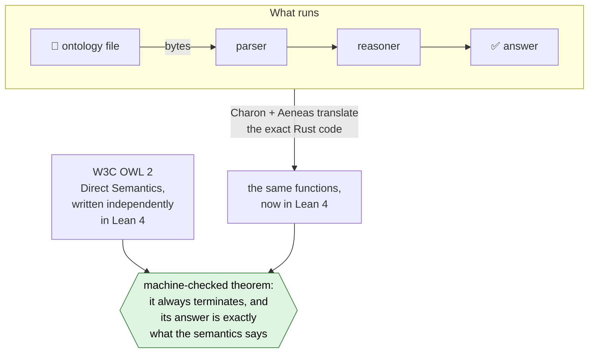

# ROWL

**An OWL 2 reasoner in Rust whose answers come with a machine-checked proof,
from the bytes of the ontology file to the final yes or no.**

> Research project, work in progress. The proofs cover a growing part of OWL
> today (see [Status](#status)); full OWL 2 DL is the goal, not yet the present.

## Why

Ontologies written in [OWL](https://www.w3.org/TR/owl2-overview/) record what a
field knows: diseases and drugs, genes, the parts of a machine. A *reasoner*
draws the conclusions: it finds contradictions, builds class hierarchies and
answers questions such as *"which pumps need inspection?"*

Reasoners are large, heavily optimised programs. When one is wrong, the wrong
answer looks exactly like a right one; all that stands behind it is trust in the
code. That is a weak foundation for conclusions that feed medicine, safety
reviews or further automated decisions.

ROWL takes the other route: **don't trust the code, check it.**

| | Typical reasoner | ROWL |
| --- | --- | --- |
| Why believe an answer? | The code was tested | A theorem about the code was machine-checked |
| What you have to trust | The whole optimised reasoner | Lean's small proof kernel, the Rust compiler and translation tools, and the written-down semantics |

## How

The reasoner is ordinary Rust. Charon and Aeneas translate that exact code into
the proof assistant [Lean 4](https://lean-lang.org). There it is proved correct
against a formalisation of the W3C OWL 2 Direct Semantics that is written
independently of the code.



Concretely, the theorems say:

- **It terminates.** Every verified function is proved to terminate on every
  input.
- **The parser is exact.** A document is accepted exactly when an independent
  grammar derives it, and errors report the first failing position.
- **The answers are exact.** Each yes or no equals the W3C definition of
  consistency, satisfiability, subsumption or instance checking, over all
  models, however large. Outside the supported fragment there is no answer
  rather than a wrong one.
- **No shortcuts.** No `sorry`, no admitted lemmas, no custom axioms: all 900+
  public theorems are audited to depend only on Lean's three standard axioms.

## Example

[`examples/maintenance-individuals.ofn`](examples/maintenance-individuals.ofn) says,
in OWL Functional Syntax (abridged):

```text
SubClassOf(ex:Pump ex:Machine)
SubClassOf(ObjectIntersectionOf(ex:Machine ObjectSomeValuesFrom(ex:hasPart ex:FaultyPart))
           ex:NeedsInspection)
ClassAssertion(ex:Pump ex:pump1)
ObjectPropertyAssertion(ex:hasPart ex:pump1 ex:motor1)
ClassAssertion(ex:FaultyPart ex:motor1)
```

```console
$ cargo run -p rowl --example source_individuals
The fleet's axioms are consistent: true
pump1 needs inspection: true
pump2 needs inspection: false
pump2 is a machine: true
```

pump1 needs inspection in every model of the file. For pump2 this does not
follow ("false"), since nothing says pump2 has a faulty part. Each answer comes
from code proved to compute exactly the Direct Semantics of the bytes in that
file.

Role axioms work the same way: in
[`examples/maintenance-roles.ofn`](examples/maintenance-roles.ofn), `hasPart` is
transitive and `hasComponent` is one of its sub-properties, so a faulty bearing
in a motor in pump1 makes pump1 need inspection
(`cargo run -p rowl --example source_roles`).

## Status

The Rust model represents every OWL 2 DL construct, and the Lean semantics gives
every one of them its meaning. The verified reasoner covers a growing fragment:

| | ✅ Proved today | 🔜 Next |
| --- | --- | --- |
| **Input** | OWL Functional Syntax documents (prefixes, header, annotations, declarations, class and object property axioms, assertions); N-Triples, passing all 68 W3C syntax tests | RDF/XML, Turtle and the other required formats |
| **Logic** | ALC (and, or, not, some, only) with named individuals, role hierarchies and transitive roles (SH) | inverse roles, number restrictions, nominals and datatypes, up to full OWL 2 DL (SROIQ(D)) |
| **Questions** | consistency, class satisfiability, subsumption, instance checking | classification, query answering |
| **Focus** | correctness | performance |

There is no release yet: v0.1 requires all of OWL 2 DL, the normative datatypes
and proofs from bytes to answers. [`docs/status.md`](docs/status.md) states
exactly what is proved and what is not.

## Quick start

```sh
python3 scripts/bootstrap.py        # hash-pinned Rust, Lean and Aeneas (Linux x86_64, Python 3.12+)
export PATH="$HOME/.cargo/bin:$HOME/.elan/bin:$PATH"
cargo test --workspace              # regression tests
cargo run -p rowl --example source_individuals
python3 scripts/verify.py           # re-translate the Rust code and re-check every proof
```

[`crates/rowl/examples`](crates/rowl/examples) has one runnable example per
stage, from IRI checks to the `tbox` and `alc_ontology` reasoners.

## Repository

| Path | Contents |
| --- | --- |
| `crates/rowl-kernel` | The verified code, parser and reasoner, translated to Lean as one unit |
| `verification/` | The generated Lean translation, the OWL 2 semantics, the proofs and the theorem registry |
| `crates/rowl`, `crates/rowl-cli` | Examples and a thin command-line tool |
| [`docs/status.md`](docs/status.md) | The precise proof boundary |
| [`docs/architecture.md`](docs/architecture.md) | Design decisions, semantic pitfalls, milestones and release gates |
| [`docs/m3-m4-progress.md`](docs/m3-m4-progress.md) | Each verified stage and its input contract |

## Fine print

- "Proved" means the answer follows from the ontology as written. Whether its
  statements are true in the world is a different question.
- Answers assume enough time and memory. Typed outcomes for exhausted resources
  and cancellation are planned work.

Intended license: MIT OR Apache-2.0.
