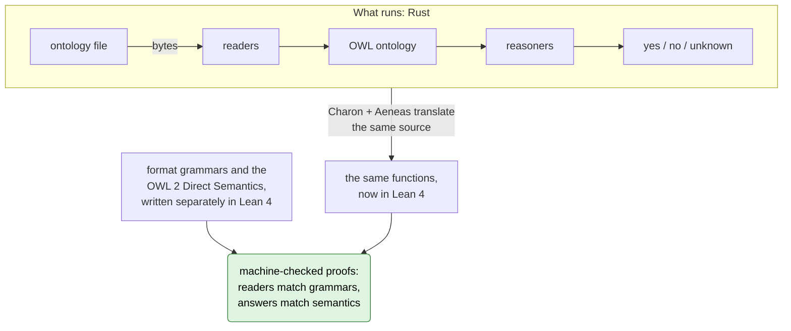

# ROWL: Rust OWL

**An OWL 2 reasoner in Rust with machine-checked proofs from the bytes of the
ontology file to the final yes or no: every answer it gives is the one that the
W3C OWL 2 semantics defines.**

> **Status: research software, no release yet.** Proved today: reasoning in
> SROIQ, the logic behind OWL 2 DL, with 19 of the 33 OWL 2 datatypes, for
> documents in Functional Syntax, Turtle, N-Triples or RDF/XML. Not proved yet:
> a decision procedure for all of OWL 2 DL. Outside the supported part, ROWL
> answers "unknown"; it does not guess. [Status](#status) has the summary and
> [docs/status.md](docs/status.md) the exact boundary.

[Why](#why) · [Try it](#try-it) · [Example](#example-medication-safety) ·
[What "verified" means](#what-verified-means-here) · [Status](#status) ·
[How it works](#how-it-works) · [Check the proofs](#check-the-proofs-yourself)

## Why

An *ontology* states what a field knows in OWL, the W3C
[Web Ontology Language](https://www.w3.org/TR/owl2-overview/): drugs and their
ingredients, diseases, genes, the parts of a machine. A *reasoner* computes
what follows from these statements. It finds contradictions, builds the class
hierarchy and answers questions such as *"does this prescription conflict with
the patient's allergies?"*

Reasoners are large, heavily optimized programs, and their answers rest on
testing. When a reasoner is wrong, the wrong answer looks exactly like a right
one. In medication safety, a missed alert is a "no" that looks like any other
"no".

ROWL takes another route: **do not trust the code, check it.** The reasoner is
ordinary Rust. Its code is translated into the proof assistant
[Lean 4](https://lean-lang.org). There it is proved to compute what the
[OWL 2 Direct Semantics](https://www.w3.org/TR/owl2-direct-semantics/) defines,
written down in Lean separately from the code.

| | Typical reasoner | ROWL |
| --- | --- | --- |
| Why believe an answer? | The code was tested | A theorem about the code was checked by machine |
| What you have to trust | The whole optimized reasoner | Lean's small proof checker, the written-down semantics, the Rust compiler and the translation tools ([details](#what-you-trust)) |

## Try it

You need Rust through [rustup](https://rustup.rs); `rust-toolchain.toml` pins
the version. Run everything below from the repository root.

```sh
cargo install --path crates/rowl-cli   # builds and installs the rowl command
```

```console
$ rowl check examples/medication-safety.ofn
consistent: yes
Answers come from the verified reader and queries, proved against the OWL 2 Direct Semantics.
$ rowl instances examples/medication-safety.ofn https://example.org/medication/AllergyAlert
https://example.org/medication/alice
Answers come from the verified reader and queries, proved against the OWL 2 Direct Semantics.
```

- `rowl classify FILE` lists each named class with its superclasses.
  `rowl validate FILE` says whether the document is OWL 2 DL.
- `rowl check FILE` is a quick test of support: it answers "unknown" for a
  document outside the supported part.
- The file extension selects the syntax: `.ttl` Turtle, `.nt` N-Triples,
  `.owl` or `.rdf` RDF/XML, anything else Functional Syntax.
- `--imports DIR` reads the import closure from the files in `DIR`. Nothing is
  fetched from the network.
- `rowl instances` asks about each named individual that the document
  declares, makes an assertion about or names in a class expression, and lists
  those proved to be instances. It names the individuals whose answer is
  unknown and then exits with status 1. On an inconsistent ontology it lists
  nothing and exits with status 1, since every individual would follow.

**Rust.** The crates are not on crates.io yet; add `crates/rowl` as a path
dependency.

```rust
use rowl::reasoner::{default_limits, named, Reasoner};

fn main() {
    let bytes = std::fs::read("examples/medication-safety.ofn").expect("readable file");
    let Ok(records) = Reasoner::from_functional(&bytes, &default_limits()) else {
        panic!("not a document the verified reader accepts");
    };
    let med = "https://example.org/medication/";
    let alert = named(&format!("{med}AllergyAlert"));
    for patient in ["alice", "bob", "carol"] {
        let answer = records.instance_of(&format!("{med}{patient}"), &alert);
        println!("{patient}: {answer:?}"); // Some(true), then Some(false) twice
    }
}
```

Each question returns an `Option<bool>`, and `None` means unknown.
`cargo run -p rowl --example medication_safety` runs the full example below.

**Python.** The package builds the Rust library with cargo. With
`--no-build-isolation` it needs setuptools 61 or newer in the environment.

```sh
pip install --no-build-isolation ./bindings/python
```

```python
import rowl

with rowl.Reasoner.from_file("examples/medication-safety.ofn") as r:
    med = "https://example.org/medication/"
    r.instance_of(med + "alice", med + "AllergyAlert")    # True
    r.instance_of(med + "bob", med + "AllergyAlert")      # False: not entailed
    r.subsumed(med + "Amoxicillin", med + "Penicillin")  # True
    r.classify()                                          # each named class with its superclasses
```

The bindings pass text to the verified Rust code and add no reasoning; see
[bindings/python](bindings/python/README.md).

## Example: medication safety

[`examples/medication-safety.ofn`](examples/medication-safety.ofn) holds a few
prescription records in OWL Functional Syntax (abridged):

```text
TransitiveObjectProperty(ex:contains)
SubObjectPropertyOf(ex:hasActiveIngredient ex:contains)
SubClassOf(ex:Amoxicillin ex:Penicillin)
SubClassOf(ex:Azithromycin ex:Macrolide)
DisjointClasses(ex:Penicillin ex:Macrolide)
SubClassOf(ObjectIntersectionOf(ObjectSomeValuesFrom(ex:hasAllergy ex:PenicillinAllergy)
                                ObjectSomeValuesFrom(ex:receives
                                  ObjectSomeValuesFrom(ex:contains ex:Penicillin)))
           ex:AllergyAlert)
ClassAssertion(ObjectSomeValuesFrom(ex:hasAllergy ex:PenicillinAllergy) ex:alice)
ObjectPropertyAssertion(ex:receives ex:alice ex:comboPack)
ObjectPropertyAssertion(ex:receives ex:bob ex:comboPack)
ObjectPropertyAssertion(ex:contains ex:comboPack ex:capsule)
ClassAssertion(ObjectSomeValuesFrom(ex:hasActiveIngredient ex:Amoxicillin) ex:capsule)
ClassAssertion(ObjectSomeValuesFrom(ex:hasAllergy ex:PenicillinAllergy) ex:carol)
ObjectPropertyAssertion(ex:receives ex:carol ex:tablet)
ClassAssertion(ObjectSomeValuesFrom(ex:hasActiveIngredient ex:Azithromycin) ex:tablet)
```

The first five lines that `cargo run -q -p rowl --example medication_safety`
prints:

```text
The records are consistent: true
alice needs an allergy alert: true
bob needs an allergy alert: false
carol needs an allergy alert: false
carol's tablet has an active ingredient that is no penicillin: true
```

- **alice** is allergic to penicillins. Her combination pack contains a
  capsule, and the capsule's active ingredient is amoxicillin, a penicillin.
  That ingredient is two levels down and has no name in the records. Because
  `contains` is transitive and every active ingredient is contained, the alert
  holds in every model of the records.
- **bob** receives the same pack, but no allergy is recorded. No alert follows.
- **carol** has the same allergy. Her tablet's active ingredient is
  azithromycin, a macrolide, and macrolides are disjoint from penicillins. The
  records prove that this ingredient is no penicillin, and no alert follows.

Here `false` means *not entailed by the records*, not *proved safe*: the
records do not say that carol's tablet contains nothing else. OWL assumes an
open world, and ROWL reports exactly what follows from the records. This is an
illustration, not clinical guidance.

<details>
<summary>Numbers work the same way: daily dose limits</summary>

[`examples/medication-dose.ofn`](examples/medication-dose.ofn) flags a
paracetamol prescription above 4000 mg a day, or above 2000 mg for a child
under 12:

```text
EquivalentClasses(:Child DataSomeValuesFrom(:patientAgeYears
                    DatatypeRestriction(xsd:integer xsd:maxExclusive "12"^^xsd:integer)))
SubClassOf(ObjectIntersectionOf(:Paracetamol DataSomeValuesFrom(:dailyDoseMg
             DatatypeRestriction(xsd:decimal xsd:minExclusive "4000"^^xsd:decimal))) :DoseAlert)
SubClassOf(ObjectIntersectionOf(:Paracetamol :Child DataSomeValuesFrom(:dailyDoseMg
             DatatypeRestriction(xsd:decimal xsd:minExclusive "2000"^^xsd:decimal))) :DoseAlert)
```

```console
$ rowl instances examples/medication-dose.ofn https://example.org/dose/DoseAlert
https://example.org/dose/rx1
https://example.org/dose/rx3
https://example.org/dose/rx4
Answers come from the verified reader and queries, proved against the OWL 2 Direct Semantics.
```

rx1 is 3000 mg for a child of 8, rx3 is 4000.5 mg, and rx4 is
`"8001/2"^^owl:rational` mg, the same number. rx2, 3000 mg for an adult, is not
flagged. With a hard maximum on paracetamol, `SubClassOf(:Paracetamol
DataAllValuesFrom(:dailyDoseMg DatatypeRestriction(xsd:decimal xsd:maxInclusive
"4000"^^xsd:decimal)))`, the records become inconsistent. Numbers are compared
exactly.

</details>

## What "verified" means here

### What is proved

Each verified Rust function has a Lean theorem about its translation. Together
they say:

- **Reading is exact.** Each reader is proved against a grammar written
  independently of it. Within stated size limits, it accepts exactly the
  documents that the grammar derives and returns what they denote; otherwise
  it reports an error. For Functional Syntax, N-Triples and Turtle, that error
  is the first one in the document.
- **Answers are exact.** Every yes or no equals the W3C definition of
  consistency, class satisfiability, subsumption or instance checking for the
  axioms read, under the OWL 2 datatype map. The theorems quantify over all
  models of any size, infinite ones included.
- **"Unknown", not a guess.** If an ontology or a question uses something
  outside the supported part, or a size limit is reached, the answer is
  "unknown" (`None`).
- **It finishes, with one exception.** For Functional Syntax input, every call
  from the bytes to the answer is proved to return. One step is not yet proved
  to finish: reading the OWL ontology out of an RDF graph (Turtle, N-Triples,
  RDF/XML). Whenever it finishes, its result is proved correct. These are facts
  about the mathematics of the code; they do not bound time or memory.
- **No gaps in the proofs.** No `sorry`, no admitted lemma, no custom axiom.
  `scripts/verify.py` checks that each of the 5445 public theorems and 1815
  semantic definitions depends only on Lean's three standard axioms
  (`propext`, `Classical.choice` and `Quot.sound`).

To see the statements themselves, start with `source_consistent_correct` and
its siblings in
[verification/Rowl/SourceReasoning.lean](verification/Rowl/SourceReasoning.lean).
They cover the whole path from Functional Syntax bytes: the call returns, an
error is exactly the reader's error, and an answer is the Direct Semantics
answer for the ontology that the bytes denote.
[verification/theorems.json](verification/theorems.json) lists every audited
theorem by module.

### What you trust

A proof is only as good as what it rests on. For ROWL, that is:

- **Lean's kernel**, the small program that checks every proof step, and
  Lean's three standard axioms.
- **The specification.** The Lean definitions of the OWL 2 Direct Semantics and
  of the grammars are written by hand from the W3C and IETF documents. They are
  separate from the algorithms that they judge, but they use the Lean
  translation of ROWL's own data types. That they say what the documents say is
  checked by review, not by machine.
- **The translation.** [Charon](https://github.com/AeneasVerif/charon) and
  [Aeneas](https://github.com/AeneasVerif/aeneas) must translate the Rust code
  into Lean faithfully, and Aeneas's Lean models of Rust's primitive types and
  library functions must be right. Their versions are pinned, and
  `scripts/bootstrap.py` checks the hashes of the tools it downloads.
- **The tools and the machine.** The Rust compiler and standard library build
  the program that runs, the build tools drive the checks, and a real machine
  runs it all.
- **The glue.** The `Reasoner` facade, the CLI, the C interface and the Python
  package are not verified. They read files, pass text and print answers; they
  add no reasoning.

The proofs do not cover running out of memory or stack. Typed outcomes for
exhausted resources and for cancellation are planned.

### Reading the answers

- **Consistency and class satisfiability.** `true`: a model exists (for a
  class, a model with an instance of it). `false`: no such model exists.
- **Subsumption and instance checking.** `true`: the statement holds in every
  model, so it is entailed. `false`: it fails in some model, so it is not
  entailed. That is not a proof of the opposite.
- **`None`, "unknown".** No answer: the ontology or the question is outside the
  supported part, or a size limit was reached.

An inconsistent ontology entails every statement, so subsumption and instance
questions about it answer `true`. Check consistency first; a separate outcome
for this case is planned.

"Proved" means that the answer follows from the ontology as written. Whether
the ontology's statements are true of the world is a different question.

## Status

There is no release yet. This is the summary;
[docs/status.md](docs/status.md) states exactly what is proved and what is not.

### Formats

| Format | Reading | Evidence |
| --- | --- | --- |
| OWL 2 Functional Syntax | Whole documents: all 37 axiom forms, 18 class expressions and 6 data ranges | Proved against the grammar |
| Turtle | Yes | Proved; passes all 313 W3C Turtle tests |
| N-Triples | Yes | Proved; passes all 68 W3C syntax tests |
| RDF/XML | UTF-8 documents; XML literals, external entities and some DTD declarations are declined | Proved; passes the W3C RDF/XML tests except the 3 with XML literals |
| N-Quads, TriG, JSON-LD, RDFa | Not yet | |

- From an RDF graph, the OWL ontology is read by the reverse of the W3C mapping
  from OWL to RDF. Whenever it returns an ontology, that ontology is proved to
  map back to exactly the input graph. Conversely, the graph of every ontology
  in a broad class, described in [docs/status.md](docs/status.md), is proved to
  be read back to that ontology.
- An RDF document must itself declare every class, datatype and property that
  it uses, even those that come from the documents it imports.
- Import closures are read from a catalog of local documents
  (`--imports DIR`). The assembled axioms are proved to have exactly the models
  of the import closure.

### Logic

ROWL decides SROIQ, the description logic behind OWL 2 DL, together with data
properties:

- **Classes:** and, or, not, some, only, has-value, one-of over named
  individuals, self restrictions, and number restrictions (qualified or not) on
  simple properties, as OWL 2 DL requires.
- **Object properties:** inverses, sub- and equivalent properties, property
  chains, domains and ranges; transitive, symmetric, functional, inverse
  functional, reflexive, irreflexive, asymmetric and disjoint properties; the
  universal and the empty property.
- **Individuals:** class and property assertions, negative property assertions,
  same and different individuals, anonymous individuals.
- **Data properties:** domains, ranges, sub-, equivalent and disjoint
  properties, functional properties; some, only, has-value and number
  restrictions; positive and negative assertions.
- **Keys:** `HasKey` with object properties.
- **Not yet:** keys with data properties, datatype definitions,
  `owl:topDataProperty` other than as a superproperty, and a few corner cases
  that [docs/status.md](docs/status.md) lists. They are answered "unknown".

### Datatypes

- **Supported:** 19 of the 33 OWL 2 datatypes: `xsd:string`, `rdf:PlainLiteral`,
  `xsd:boolean`, `owl:real`, `owl:rational`, `xsd:decimal`, and `xsd:integer`
  with its 12 subtypes, such as `xsd:nonNegativeInteger`.
- **Facets:** `xsd:minInclusive`, `xsd:maxInclusive`, `xsd:minExclusive` and
  `xsd:maxExclusive` on the numeric datatypes. Numbers are compared exactly:
  `"8001/2"^^owl:rational` and `"4000.5"^^xsd:decimal` are the same value.
- **Not yet:** `xsd:double`, `xsd:float`, `xsd:dateTime`, `xsd:dateTimeStamp`,
  `xsd:anyURI`, `xsd:hexBinary`, `xsd:base64Binary`, `rdf:XMLLiteral`, the
  types derived from `xsd:string` (such as `xsd:token`), and the other facets
  (such as `xsd:length` and `xsd:pattern`).

### Questions

- **Answered:** consistency, class satisfiability, subsumption, instance
  checking, and classification of the named classes.
- **Validation:** `rowl validate` and `dl_violation()` say whether a document
  is OWL 2 DL and name the first violation. The lexical forms of literals and
  facet values are not checked yet.
- **Not yet:** entailment of other facts (property assertions, equality of
  individuals), evidence for an answer that others can replay, and typed
  outcomes for cancellation and exhausted resources.

### Toward v0.1

Release v0.1 needs all of OWL 2 DL with all its datatypes and facets, the
remaining formats (reading N-Quads, TriG, JSON-LD and RDFa; writing RDF/XML,
N-Quads, TriG and JSON-LD), entailment of named facts, typed outcomes for
cancellation and exhausted resources, and one proved composition from the
input bytes to the answers that covers all of it. The release ledger,
[`docs/coverage.json`](docs/coverage.json), tracks 5638 obligations; 215 of
them are still open. The next steps are in
[docs/status.md](docs/status.md#next-milestones), and the milestones and
release gates in [docs/architecture.md](docs/architecture.md#milestones).

## How it works



- **One verified kernel.** `crates/rowl-kernel` holds every verified function:
  the readers, the RDF mapping, the import assembly, the OWL 2 DL check and the
  reasoners. The workspace uses no third-party crates, and only the C interface
  uses `unsafe`.
- **Translated as one unit.** Charon and Aeneas translate the whole kernel into
  one Lean development. The reader's output and the reasoner's input are
  therefore the same Lean values, and the proofs compose without extra
  assumptions. `scripts/verify.py` runs the translation again and fails if the
  result differs from the checked-in Lean.
- **Specified separately.** Other Lean files state what the code must do: the
  grammars of the W3C and IETF documents, and the OWL 2 Direct Semantics. The
  proofs connect the two.
- **Reasoning.** Ontologies in the logic EL (intersections and existential
  restrictions) are classified and checked for consistency by saturation. All
  others go to tableau procedures, which try to build a model and report a
  clash when none can exist. There are two: a completion graph, and a
  completion forest for counting, nominals and self restrictions. Property
  chains are encoded with automata, and data values as classes and
  individuals. Classification reuses the told subclass axioms and tests the
  remaining pairs in groups.
- **Termination.** Aeneas turns each loop and recursion into a Lean definition
  that could diverge (`partial_fixpoint`). A theorem that the result is `ok`
  rules this out; that is how the termination results above are proved.

## Performance

Measured on a shared development machine; the
[progress log](docs/m3-m4-progress.md) has the details.

- A generated EL ontology with 20 000 classes classifies in about 1.2 s from
  Functional Syntax, in 0.4 to 0.7 s from Turtle or N-Triples, and in 1.3 s
  from its 7.9 MB RDF/XML form.
- Ontologies outside EL go to the tableau procedures, which are slower. For
  ontologies of independent records, consistency is checked record by record,
  instance questions ask only the record's part and class questions only the
  axioms other than assertions: for 300 medication-dose prescriptions, the
  consistency check takes 0.2 s, listing the overdoses 1.1 s and classifying
  the classes 0.2 s. Other performance work is in progress.

## Check the proofs yourself

```sh
python3 scripts/bootstrap.py   # pinned Rust, Lean 4 and Aeneas (Linux x86_64, Python 3.12+)
export PATH="$HOME/.cargo/bin:$HOME/.elan/bin:$PATH"
cargo test --workspace         # 661 Rust regression tests
python3 scripts/verify.py      # translate the Rust code again, rebuild every proof, audit the axioms
```

`verify.py` fails if the translation differs from the checked-in Lean, if a
proof file contains `sorry`, `admit` or a new axiom, or if a registered theorem
depends on more than Lean's three standard axioms. It rebuilds the whole Lean
development, which takes a while. The W3C test suites are fetched separately
(`scripts/fetch-*-suite.py`).

## Repository

| Path | Contents |
| --- | --- |
| [`crates/rowl-kernel`](crates/rowl-kernel) | All verified code, translated to Lean as one unit |
| [`crates/rowl-frontend`](crates/rowl-frontend) | Re-exports the kernel's frontend stages (readers and import assembly) under their earlier paths |
| [`crates/rowl`](crates/rowl) | The `Reasoner` facade and runnable [examples](crates/rowl/examples) (unverified glue) |
| [`crates/rowl-cli`](crates/rowl-cli) | The `rowl` command (unverified glue) |
| [`crates/rowl-python`](crates/rowl-python), [`bindings/python`](bindings/python) | The C interface and the Python package (unverified glue) |
| [`verification`](verification) | The generated Lean translation, the OWL 2 semantics, the proofs and the [theorem registry](verification/theorems.json) |
| [`examples`](examples) | The example ontologies |
| [`docs/status.md`](docs/status.md) | The precise proof boundary |
| [`docs/m3-m4-progress.md`](docs/m3-m4-progress.md) | Each verified stage: its theorems, input contract and measurements |
| [`docs/architecture.md`](docs/architecture.md) | Scope, design decisions, milestones and release gates |
| [`docs/formats.md`](docs/formats.md) | The serialization scope |
| [`docs/coverage.json`](docs/coverage.json) | The release ledger |

Intended license: MIT OR Apache-2.0.
